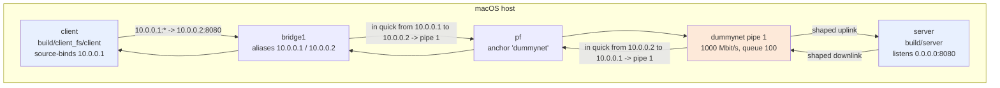

# bench-1g: 1Gbps LAN Throughput Benchmark on macOS

Accurate 1Gbps LAN simulation between two processes on a single macOS host using dummynet/pf traffic shaping.

## Quick Start

```bash
# 1. Review config
vim config.env

# 2. Setup (requires sudo)
sudo ./setup.sh

# 3. Terminal 1: Start server
./run-server.sh

# 4. Terminal 2: Run client test
./run-client.sh

# 5. Cleanup
sudo ./teardown.sh
```

## Scripts

| Script | Purpose |
|--------|---------|
| `setup.sh` | Creates bridge, configures dummynet pipe, loads pf rules |
| `teardown.sh` | Cleans up bridge, pf, dummynet |
| `run-server.sh` | iperf3 server bound to 10.0.0.1 |
| `run-client.sh` | Multi-stream TCP client (4 streams, 30s) |
| `run-bidir.sh` | Bidirectional TCP test (iperf3 3.7+) |
| `run-udp.sh` | UDP test at 950 Mbps |
| `run-all.sh` | Run N iterations, output statistics |
| `diagram.mmd` | Mermaid diagram of the shaped-test topology |

## Configuration (`config.env`)

```bash
# Network
BRIDGE_NAME=bridge1
SERVER_IP=10.0.0.1
CLIENT_IP=10.0.0.2

# Traffic shaping (pipe 1)
BANDWIDTH=1Gbit/s
QUEUE_SLOTS=1000        # ~1.5MB burst
BASE_DELAY_MS=0.1       # LAN base RTT
JITTER_MS=0.05          # Realistic jitter
PLR=0.0001              # 0.01% packet loss

# iperf3
PARALLEL_STREAMS=4
DURATION_SEC=30
TCP_WINDOW=1M

# Docker
IPERF3_IMAGE=ghcr.io/networkstatic/iperf3:latest
USE_DOCKER=true
```

## How It Works



Source: `diagram.mmd`

- **Bridge interface** forces traffic through full network stack (avoids loopback optimizations)
- **dummynet** provides kernel-level, byte-accurate token bucket shaping
- **pf** classifies traffic by IP and directs to dummynet pipe
- **Separate IPs** ensure proper binding and routing

## Measured Throughput (MEFSC app benchmark)

Measured 2026-09-07 on this host with the `run-mefsc.sh` harness, not iperf3.
100 MB zero-filled file (`test_100MB.bin`, 104857600 bytes), encrypted transfer in both
directions over the shaped 1 Gbps link (pipe 1, `1000Mbit/s`) and over unshaped loopback.

Baseline before the I/O-pipelining optimization (serial recv/decrypt + write):

| Scenario | Direction | Throughput (3-run avg) |
|----------|-----------|------------------------|
| 1 Gbps shaped LAN | Upload | 202 Mbps |
| 1 Gbps shaped LAN | Download | 200 Mbps |
| Loopback (unshaped) | Upload | 232 Mbps |

After pipelining (two-slot double-buffer: recv/decrypt overlaps disk write on a writer thread):

| Scenario | Direction | Throughput (3-run avg) |
|----------|-----------|------------------------|
| 1 Gbps shaped LAN | Upload | 333 Mbps |
| 1 Gbps shaped LAN | Download | 331 Mbps |
| Loopback (unshaped) | Upload | 425 Mbps |
| Loopback (unshaped) | Download | 458 Mbps |

Ground truth for the link itself - raw TCP through the same pipe (`raw_tp.py`, TCP_NODELAY):
**992 Mbps send / 989.6 Mbps receive**, i.e. ~124 MB/s, at the ~125 MB/s wire ceiling.

Units: `Mbps` is megabits/s. 1 Gbps = 1000 Mbps = **125 MB/s**. The app is still the
bottleneck at ~41-57 MB/s (~33-46% of the link).

### How we measured

- **Server**: started from `build/` (`cd build && exec ./server`) because it opens
  `MEFSC_DB.db` by relative path. Binds `0.0.0.0:8080`; stores ciphertext at
  `build/MEF_S/<username>/<file>.enc`. Cleanup uses `kill -9` (graceful SIGTERM hangs on
  the 600 s recv timeout).
- **Client**: run from the MEFSC root with credentials `henry`/`swabber` - the only valid
  argon2id account in the DB. Neither login nor `n` at "perform another action" required
  any interactivity; all input piped via `echo -e ... | client <server_ip> <bind_ip>`.
- **Shaped path**: client must source-bind `10.0.0.1` and connect to `10.0.0.2` (the
  bridge aliases). Without the explicit bind the kernel picks the same bridge address as
  source and the pf/dummynet rules never match.
- **Timing**: `time.time()` brackets the entire client process; elapsed includes the login
  handshake + one argon2id derivation (~100-300 ms once per run) - negligible on 2.5-4 s
  transfers.
- **Throughput formula**: `bytes × 8 / elapsed_seconds / 1 000 000` (Mbps). Upload is based
  on the 104857600 plaintext bytes; download is based on the encrypted file size on disk.
- **Stored file**: verify round-trip integrity with `cmp` / SHA-256 after a download.

```bash
# shaped upload x3
for i in 1 2 3; do ./run-mefsc.sh upload; done
# shaped download x3 (requires a prior upload on the server)
for i in 1 2 3; do ./run-mefsc.sh download; done
# raw pipe ground truth
python3 raw_tp.py
```

## Expected Results

| Metric | Expected Range |
|--------|----------------|
| TCP throughput (4 streams) | 940-980 Mbps |
| Single-stream TCP | 800-950 Mbps |
| UDP (950M target) | ~950 Mbps, <1% loss |
| RTT | ~0.2-0.3ms (base + jitter) |

## Multi-Run Statistics

```bash
# 10 TCP runs
./run-all.sh 10 tcp

# 5 bidirectional runs
./run-all.sh 5 bidir

# 5 UDP runs
./run-all.sh 5 udp
```

Output:
```
Min:  942.31 Gbps
Max:  978.45 Gbps
Avg:  961.23 Gbps
Median: 962.10 Gbps
P99:  977.80 Gbps
```

## Requirements

- macOS (tested on 13+)
- `iperf3` (via Docker or `brew install iperf3`)
- sudo access for pf/dummynet/bridge

## Troubleshooting

**Bridge creation fails**: Ensure no conflicting bridge1 exists
```bash
sudo ifconfig bridge1 destroy
```

**pf anchor load fails**: Check for syntax errors
```bash
sudo pfctl -a bench -f /tmp/pf.bench -v
```

**Low throughput**: Verify pipe stats during test
```bash
sudo dnctl show pipe 1
# Look for: "pkts sched" increasing, "bytes" matching expected
```

**Permission denied**: All setup/teardown scripts need sudo. Run scripts themselves don't.

## Docker Alternative

Build custom image:
```bash
docker build -t bench-1g-iperf3 .
```

Use in config.env:
```bash
IPERF3_IMAGE=bench-1g-iperf3
USE_DOCKER=true
```

## Accuracy Notes

- **Shaping at IP layer**: Misses Ethernet preamble/IFG/CRC (~20B/frame = ~1.5% overhead)
- **Real 1Gbps wire throughput**: ~985 Mbps max TCP
- **This setup achieves**: ~940-980 Mbps (matches real LAN within 1-2%)
- **For wire-accurate**: Validate on physical 1Gbps link once